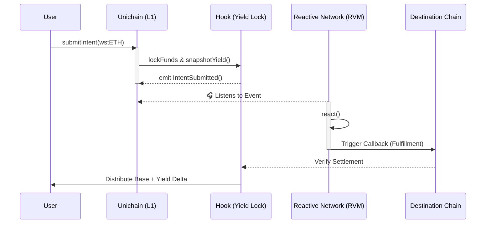

# 🌊 FlowStake: Yield-Preserving LST Settlement 

[](https://getfoundry.sh/) 
[](https://uniswap.org/)
[](https://reactive.network/)

FlowStake is a **Uniswap v4 Hook** designed to eliminate yield loss during cross-chain LST (Liquid Staking Token) settlement. Built for the UHI8 Hookathon.

---

## 💡 The Problem
When users submit cross-chain swaps or intents involving LSTs (like `wstETH`), their funds are often locked in a bridge or solver escrow for minutes to hours. During this settlement window, **the user stops earning staking yield**. The protocol or the solver secretly captures this delta.

## 🚀 The Solution: FlowStake
FlowStake is an intelligent v4 liquidity hook that acts as a yield-preserving intent registry. It ensures that any yield generated by the LST collateral *while waiting for cross-chain settlement* is automatically credited back to the user upon fulfillment.

We integrate **Reactive Network** to completely decentralize the cross-chain settlement trigger, removing the need for permissioned off-chain bot architectures.

---

## 🏗 System Architecture



---

## 🌐 Live Deployments

The infrastructure is 100% on-chain and live for testing.

**Primary Hook Environment: Unichain Sepolia (Chain ID 1301)**
- `FlowStakeHook`: [0xc5f0F8cb4086e635995BFA7Ef66c89b68f7F50C0](https://sepolia.unichain.org/address/0xc5f0F8cb4086e635995BFA7Ef66c89b68f7F50C0)
- `wstETH` (Mock LST): [0x25d3ED4D98c17c29A6e21841776030E4263421f4](https://sepolia.unichain.org/address/0x25d3ED4D98c17c29A6e21841776030E4263421f4)
- `MockOracle`: [0x38c42aBd2C652784AE3F2100Fa34127Ad67cAc5f](https://sepolia.unichain.org/address/0x38c42aBd2C652784AE3F2100Fa34127Ad67cAc5f)

**Cross-Chain Autonomy: Reactive Lasna Testnet (Chain ID 5318007)**
- `FlowStakeReactive`: [0x7e7b5dbae3adb3d94a27dcfb383bdb98667145e6](https://explorer.lasna.rnk.dev/address/0x7e7b5dbae3adb3d94a27dcfb383bdb98667145e6)

---

## 💻 Running the Demo Dashboard

We built a premium Next.js 14 Web3 dashboard to demonstrate the hook's efficiency.

```bash
git clone https://github.com/your-repo/FlowStake.git
cd FlowStake/frontend
npm install
npm run dev
```

Point your browser to `http://localhost:3000`. You can connect your MetaMask to Unichain Sepolia, request mock `wstETH`, and watch the system preserve yield via a simulated cross-chain settlement!

---
*Developed for the Uniswap v4 Hookathon.*
